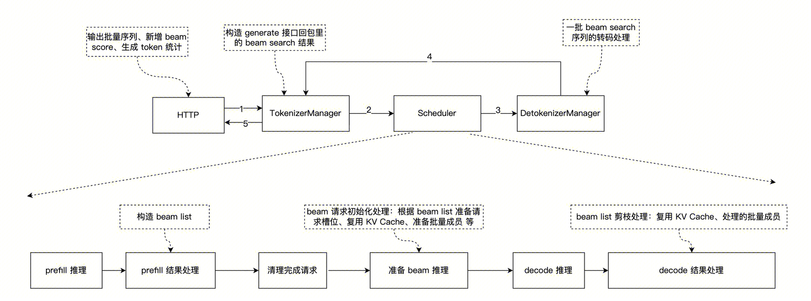

# SGLang Beam Search 实现说明技术文档

---

# 1. Beam Search 原理

Beam Search 通过维护 **beam_width（束宽）** 条候选路径，来生成多个序列：

1. **初始化**：Prefill 阶段完成后，从 logprobs 中取 top-k 个 token，初始化 beam_width 条候选路径
2. **扩展**：每个 Decode 步骤中，对每条候选路径扩展 top-k 个候选 token，共产生 `beam_width × k` 个新候选
3. **剪枝**：从所有候选中保留累积得分最高的 beam_width 条路径，其余丢弃
4. **终止**：当路径遇到停止条件（EOS token、stop string、max_new_tokens）时，将其移入已完成列表；当所有路径完成时，返回得分最高的 beam_width 条序列

---

# 2. SGLang Beam Search 使用说明

## 2.1. 服务端启动

### 2.1.1. 启动参数

通过 `--enable-beam-search` 参数启用 beam search 模式：

```bash
python -m sglang.launch_server \
    --model-path meta-llama/Llama-3.1-8B-Instruct \
    --enable-beam-search \
    --port 30000
```

### 2.1.2. 自动禁用的不兼容特性

启用 `--enable-beam-search` 后，SGLang 会自动检测并禁用以下不兼容的特性，并打印 warning 日志：

- PD 分离（disaggregation）
- Pipeline Parallelism（流水线并行）
- Overlap Schedule（重叠调度）
- Chunked Prefill（分块预填充）

---

## 2.2. 请求参数说明

Beam search 通过标准的 OpenAI 兼容接口触发，关键参数：

| 参数 | 类型 | 说明 |
|------|------|------|
| `n` | int | **beam_width**，必须 > 1 才会触发 beam search（服务端需同时开启 `--enable-beam-search`） |
| `max_tokens` | int | 每条 beam 序列的最大生成 token 数 |

> **触发条件**：服务端 `--enable-beam-search` 为 True，**且** 请求中 `n > 1`，两个条件同时满足才会走 beam search 路径。

> **关于 stream 模式**：beam search 需要等所有 beam 路径全部推理完成后，才能确定最终保留哪些序列并排序返回，因此本质上不支持流式输出。接口层虽然对 `stream=true` 做了兼容处理，但实际行为与非流式相同（结果在推理完成后一次性返回），**不建议在 beam search 场景下使用 `stream=true`**。

---

## 2.3. 请求示例

### 2.3.1. v1/completions 接口

```bash
curl http://localhost:30000/v1/completions \
  -H "Content-Type: application/json" \
  -d '{
    "model": "meta-llama/Llama-3.1-8B-Instruct",
    "prompt": "beam search is",
    "n": 3,
    "max_tokens": 10
  }'
```

### 2.3.2. v1/chat/completions 接口

```bash
curl http://localhost:30000/v1/chat/completions \
  -H "Content-Type: application/json" \
  -d '{
    "model": "meta-llama/Llama-3.1-8B-Instruct",
    "messages": [
      {"role": "user", "content": "Beam search is"}
    ],
    "n": 3,
    "max_tokens": 10
  }'
```

---

## 2.4. 回包结构说明

### 2.4.1. v1/completions 回包示例

```json
{
    "id": "44be731750614158976ebc0516223555",
    "object": "text_completion",
    "created": 1773308309,
    "model": "meta-llama/Llama-3.1-8B-Instruct",
    "choices":
    [
        {
            "index": 0,
            "text": " a technique used in the field of machine learning for",
            "logprobs": null,
            "finish_reason": "length",
            "matched_stop": null,
            "sglext":
            {
                "sequence_score": -0.9359568595886231
            }
        },
        {
            "index": 1,
            "text": " a technique used in the field of machine learning,",
            "logprobs": null,
            "finish_reason": "length",
            "matched_stop": null,
            "sglext":
            {
                "sequence_score": -0.9359568595886231
            }
        },
        {
            "index": 2,
            "text": " a technique used in the field of machine learning to",
            "logprobs": null,
            "finish_reason": "length",
            "matched_stop": null,
            "sglext":
            {
                "sequence_score": -0.973456859588623
            }
        }
    ],
    "usage":
    {
        "prompt_tokens": 3,
        "total_tokens": 33,
        "completion_tokens": 30,
        "prompt_tokens_details": null,
        "reasoning_tokens": 0
    },
    "metadata":
    {
        "weight_version": "default"
    }
}
```

### 2.4.2. v1/chat/completions 回包示例

```json
{
    "id": "5df1705d0c4e4886b65d8c13b9331ed6",
    "object": "chat.completion",
    "created": 1773308477,
    "model": "meta-llama/Llama-3.1-8B-Instruct",
    "choices":
    [
        {
            "index": 0,
            "message":
            {
                "role": "assistant",
                "content": "<think>\nOkay, the user is asking about beam",
                "reasoning_content": null,
                "tool_calls": null
            },
            "logprobs": null,
            "finish_reason": "length",
            "matched_stop": null,
            "sglext":
            {
                "sequence_score": -0.15953519344329833
            }
        },
        {
            "index": 1,
            "message":
            {
                "role": "assistant",
                "content": "<think>\nOkay, so I need to explain beam",
                "reasoning_content": null,
                "tool_calls": null
            },
            "logprobs": null,
            "finish_reason": "length",
            "matched_stop": null,
            "sglext":
            {
                "sequence_score": -0.18673303127288818
            }
        },
        {
            "index": 2,
            "message":
            {
                "role": "assistant",
                "content": "<think>\nOkay, the user is asking about \"",
                "reasoning_content": null,
                "tool_calls": null
            },
            "logprobs": null,
            "finish_reason": "length",
            "matched_stop": null,
            "sglext":
            {
                "sequence_score": -0.20953519344329835
            }
        }
    ],
    "usage":
    {
        "prompt_tokens": 11,
        "total_tokens": 41,
        "completion_tokens": 30,
        "prompt_tokens_details": null,
        "reasoning_tokens": 0
    },
    "metadata":
    {
        "weight_version": "default"
    }
}
```

### 2.4.3. 关键字段说明

**v1/completions 接口：**

| 字段 | 说明 |
|------|------|
| `choices` | 包含 `n` 条 beam 序列，按 beam score 从高到低排序（index=0 为最优路径） |
| `choices[i].text` | 第 i 条 beam 序列的生成文本 |
| `choices[i].finish_reason` | 终止原因：`stop`（遇到停止条件）、`length`（达到 max_tokens） |
| `choices[i].sglext.sequence_score` | 该 beam 序列的归一化得分（`cum_logprob / seq_len^length_penalty`），值越大越优 |
| `usage.completion_tokens` | **所有 beam 序列的 token 总和**（非单条序列长度），用于计费统计 |

**v1/chat/completions 接口：**

| 字段 | 说明 |
|------|------|
| `choices` | 包含 `n` 条 beam 序列，按 beam score 从高到低排序（index=0 为最优路径） |
| `choices[i].message.content` | 第 i 条 beam 序列的生成文本 |
| `choices[i].finish_reason` | 终止原因：`stop`（遇到停止条件）、`length`（达到 max_tokens） |
| `choices[i].sglext.sequence_score` | 该 beam 序列的归一化得分（`cum_logprob / seq_len^length_penalty`），值越大越优 |
| `usage.completion_tokens` | **所有 beam 序列的 token 总和**（非单条序列长度），用于计费统计 |

> **注意**：`usage.completion_tokens` 是所有 beam 路径生成 token 的总和，而非单条序列的长度。例如 beam_width=3，每条序列生成 10 个 token，则 `completion_tokens = 30`。

---

# 3. Beam Search 关键设计点说明

## 3.1. 需要考虑的关键问题

在 SGLang 的常规推理流程上添加 beam search 功能，需要考虑以下关键点：
1. 用户使用协议
2. 内部模块间的数据传输协议
3. prefill 推理完成后的处理：过滤结束请求；构造 beam list；准备 beam list 的请求槽位和 KV Cache 以衔接模型推理对象
4. decode 推理完成后的处理：过滤结束清求；扩展 beam list 候选和剪枝，维护请求槽位和 KV Cache
5. beam search 请求结束判断条件
6. 结果输出处理：填充 choices 数组、增加 sequence_score、重算 completion_tokens、兼容流式请求的一次性回包

---

## 3.2. 整体流程

### 3.2.1. 普通请求的执行流程

SGLang 采用多进程架构，进程链路为：**HTTP Server → TokenizerManager → Scheduler → DetokenizerManager → TokenizerManager → HTTP 响应**。

Scheduler 是核心处理进程，其内部循环如下：

```
event_loop_normal():
  while True:
    1. recv_requests()          # 从 ZMQ 接收新请求
    2. process_input_requests() # 将请求加入等待队列，构造 Req 对象
    3. get_next_batch_to_run()  # 调度新请求（prefill）或继续运行批次（decode）
    4. run_batch(batch)         # 调用 TpWorker 执行推理
    5. process_batch_result()   # 采样、KV Cache 管理、完成检测、发送输出
```

---

### 3.2.2. Beam Search 请求的执行流程

Beam Search 请求在普通请求流程的基础上，增加 beam search 的处理流程，如下图所示：


**Scheduler 阶段与普通请求的核心差异：**

| 阶段 | 普通请求 | Beam Search 请求 |
|------|---------|-----------------|
| Prefill 后处理 | 采样 1 个 next token，加入 decode 队列 | 从 logprobs 取 top-k 初始化 beam 候选，**不采样** |
| Decode 批次组织 | 每个请求占 1 个 req slot | 每个请求占 `beam_width` 个 req slot（每个 beam 分支各一个） |
| Decode 后处理 | 采样 1 个 next token，检查完成条件 | 扩展 `beam_width × topk` 个候选，剪枝保留 top beam_width，管理 KV Cache |
| 完成条件 | 单条路径遇到 stop 条件 | 可继续执行的路径不足 beam_width 条 |
| 输出 | 1 条生成序列 | beam_width 条生成序列（按 beam score 排序） |

---

## 3.3. 关键设计点

### 3.3.1. 用户协议设计

**(1) 进程参数开关，而非请求参数开关**

Beam search 场景与非 beam search 场景一般不会混用（同一个服务实例通常只服务一种推理模式），因此选择在**进程启动参数**上添加 beam search 开关（`--enable-beam-search`），而不是在每个请求参数中添加。

这样做的好处：
- 调用方式与普通推理完全一致，避免对 OpenAI 请求参数做扩展做改造
- 避免同一 batch 中混合 beam search 与非 beam search 请求带来的调度复杂性

**(2) `n` 参数复用为 beam_width**

Beam search 的 `beam_width`（同时维护的候选路径数）复用 OpenAI 接口中已有的 `n` 参数（表示返回的候选数量），**接口无需新增任何参数**。

语义上两者天然对齐：
- 普通推理中 `n=3` 表示返回 3 条独立采样的结果
- Beam search 中 `n=3` 表示维护 3 条 beam 路径，最终返回 3 条得分最高的候选序列

约束：
- `n` 必须 > 1，否则 beam search 退化为 greedy search，服务端会在 TokenizerManager 侧做参数校验并拒绝请求

**(3) 回包新增 `choices[i].sglext.sequence_score` 字段**

sglext 在普通模式下是 response 层的字段，和 choices 平级，但因 choices 也需要一个扩展字段，所以复用了 sglext。


### 3.3.2. 内部模块间的数据传输

Beam search 在常规推理的数据传输链路上做了两处扩展，其余字段和流程与常规请求完全一致。

(1) BatchTokenIDOutput / BatchStrOutput 新增 beam_search_output 字段

(2) generate 接口回包 meta_info 新增 beam_results 字段，回包格式沿用常规请求的 `out_dict` 结构，**不引入新的顶层字段**，而是将所有 beam 候选放入 `meta_info["beam_results"]`：

```python
# 最终传给 OpenAI 接口层的 out_dict 结构
{
    "text": "<第一条 beam 的文本>",          # 沿用常规格式，取 beam_score 最高的候选
    "output_ids": [...],                     # 第一条 beam 的 token ids
    "meta_info": {
        # --- 常规字段（与普通请求一致）---
        "finish_reason": {...},              # 第一条 beam 的结束原因
        "completion_tokens": 256,            # 所有 beam 序列的 token 数之和
        "prompt_tokens": 32,
        # ...其他常规 meta 字段...

        # --- beam search 专有字段 ---
        "beam_results": [
            {
                "text": "<beam 0 文本>",
                "output_ids": [...],
                "meta_info": {
                    "finish_reason": {...},
                    "sequence_score": -1.23,  # beam 累计 log-prob 得分
                    "completion_tokens": 128,  # 仅第一条 beam 携带完整 meta
                    # ...其他常规 meta 字段...
                }
            },
            {
                "text": "<beam 1 文本>",
                "output_ids": [...],
                "meta_info": {
                    "finish_reason": {...},
                    "sequence_score": -1.87,  # 仅包含 finish_reason 和 sequence_score
                }
            },
            # ... 共 beam_width 条 ...
        ]
    }
}
```

**设计说明**：
- 顶层结构与常规请求完全一致，OpenAI 接口层的通用处理逻辑（日志、metrics、abort 处理、计时等）无需修改
- `beam_results[0]` 与顶层 `text` / `output_ids` 保持一致，均为得分最高的候选
- 只有 `beam_results[0]` 的 `meta_info` 携带完整字段（`completion_tokens` 等），其余 beam 的 `meta_info` 仅包含 `finish_reason` 和 `sequence_score`，减少冗余
- OpenAI 接口层通过检查 `meta_info.get("beam_results")` 来判断是否为 beam search 请求，并据此构造多条 `choice`

